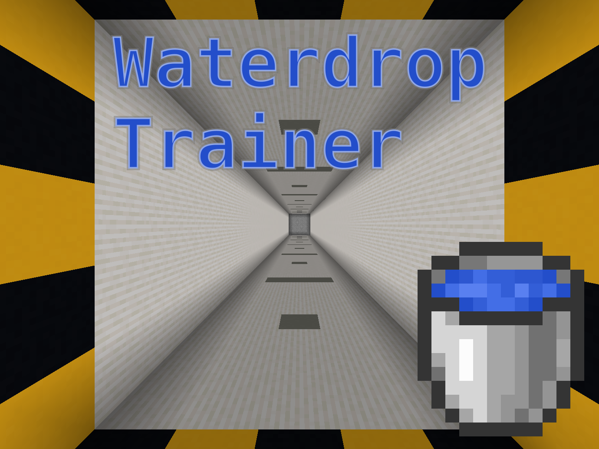

Waterdrop Trainer
=================

This repository created to track bugs and suggestions for Minecraft
map Waterdrop Trainer.

See [Releases page](https://github.com/Vovan-VE/mcmap-waterdrop-trainer/releases)
to download the map.

See also [Screenshots](_images/screens/README.md).

## Description

This map would help you to grow up your waterdrop skills.

There are two gameplay modes:

1.  **Ordered levels**. Walkthrough all available levels linear. Do three
    success waterdrop in a sequence to beat each level. Levels are all possible
    combination of predefined floor types and depths. Which depth will cause
    troubles for you?
2.  **Random levels**. Beat levels in random order. Every five success
    waterdrops in sequence will give you +1 live. With every fail will loss 1
    live. You have only 3 lives at start. Every success waterdrop gives you a
    score depending on level difficulty, environment and effects. The more
    levels you stay alive, the more effectively you will accumulate final score.
    How much score points would you get?

Bonus:

*   **Random effects** option toggles random speed/slowness and environment
    (light level) on each level.
*   Full in-game controls for current level.
*   Nausea and Blindness can be toggled manually in-game if your feel yourself
    so crazy.

## Poster

## License

This repo and map is under [MIT License](https://opensource.org/licenses/MIT)
